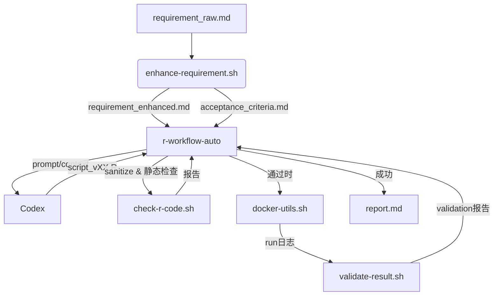

# 系统架构概览

## 总览
本项目实现“需求增强 → 代码生成与检查 → 容器执行 → 结果验证 → 自动修复”的闭环。核心组件：

1. **脚本层**（`scripts/`）负责编排任务：
   - `r-workflow-auto.sh`：端到端主控，串起需求增强、Prompt 渲染、Codex 调用、脚本清理、静态检查、容器执行与验收；支持 `--from-stage`、`--max-iters`、`--artifact` 等参数，且在修复轮里使用 `sanitize_r_script` 去除 Markdown 包装，避免非 R 内容混入 `script_vXX.R`。
   - `enhance-requirement.sh`：以模板驱动 Codex 产出 `requirement_enhanced.md` 与 `acceptance_criteria.md`，并把中间 Prompt 保存在 `tasks/<TASK>/tmp/`，便于审查/复现。
   - `check-r-code.sh`：运行 `parse()`、`lintr`、危险调用扫描与依赖探测，输出 Markdown 报告；若缺少 `rg` 会自动降级为 `grep` 并给出提示。
   - `validate-result.sh`：校验执行日志与指定产物是否存在，再结合验收标准、运行日志、产物快照构造 Prompt，让 Codex 生成文字评估；本地校验结论与 Codex 反馈一并写入 `logs/validation_XX.md`。
   - `docker-utils.sh`：封装 `docker run`/`build`，运行阶段会把任务目录挂载到 `/workspace` 并用宿主 UID/GID 运行 R 脚本，保证容器内可写 `output/`、`logs/`。

2. **模版层**（`templates/`）定义 Codex 提示结构，确保输出一致可解析。

3. **容器层**（`docker/`）提供可复现的 R 运行环境。

4. **任务工件**（`tasks/<TASK>/`）保存输入、生成脚本、日志和报告：
   - `requirement_raw.md / requirement_enhanced.md / acceptance_criteria.md`
   - `script_v01.R ... script_vNN.R` 与 `script_final.R`
   - `output/`（业务产出）、`logs/`（codex/code_check/run/validation）、`tmp/`（Prompt/上下文）、`notes.md`、`report.md`
   - 若增强文档要求衍生子任务，脚本会在 `tasks/` 下自动新建对应目录。

## 数据流

## 状态与日志
- `tasks/<TASK>/logs/`：按阶段归档 codex、检查、运行、验证日志；若缺少 `rg` 会记录警告。
- `tasks/<TASK>/tmp/`：保存 prompt、上下文、验证快照，方便复现 Codex 输入输出。
- `tasks/<TASK>/notes.md`：记录迭代状态，便于人工审计。
- `tasks/<TASK>/report.md`：执行结果摘要，可直接分享给干系人。

## 扩展点
- 新增其他语言/运行环境：扩展 `docker/Dockerfile.*` 并在 `config/default.yaml` 中声明。
- 自定义检查器：在 `scripts/check-r-code.sh` 内部新增扫描逻辑或外部插件入口。
- 多模型支持：通过 `CODEX_*_CMD_TEMPLATE` 环境变量接入不同的生成/验证服务（包括切换到纯文本模型以禁止仓库写操作）。
- 需求分拆：增强文档可以要求在 `tasks/` 下新增子任务（如 `tasks/iris-row-count/`），主控脚本会照指令创建目录并继续后续流程。
