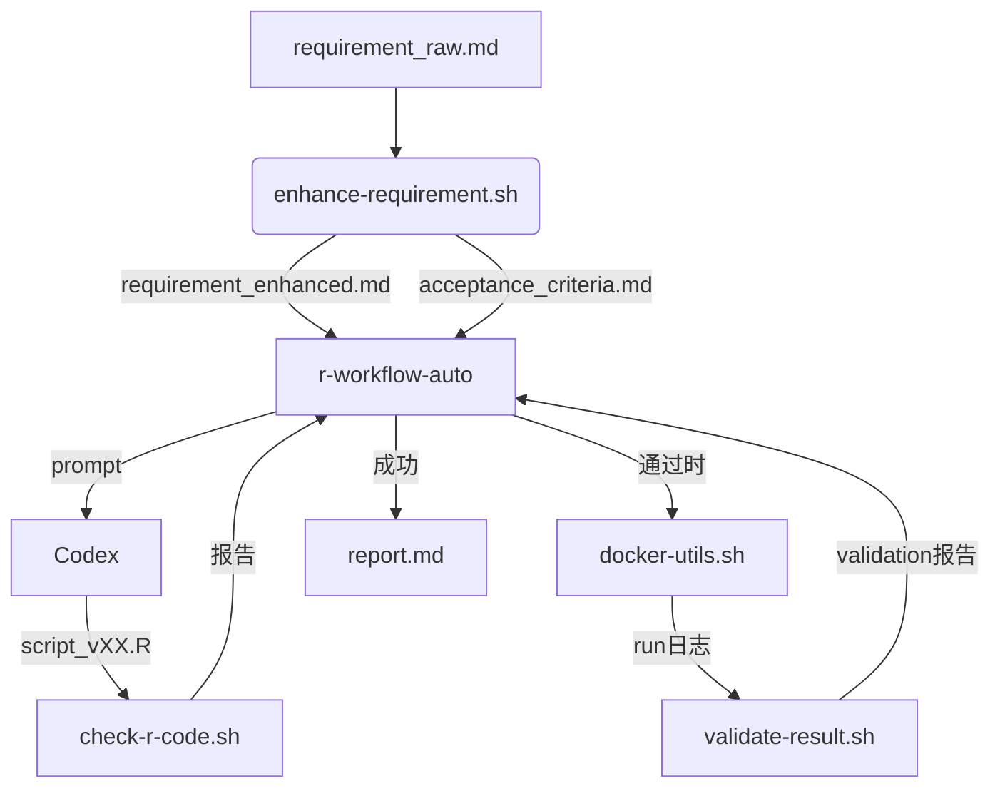

# 系统架构概览

## 总览
本项目实现“需求增强 → 代码生成与检查 → 容器执行 → 结果验证 → 自动修复”的闭环。核心组件：

1. **脚本层**（`scripts/`）负责编排任务：
   - `r-workflow-auto.sh`：主控入口，驱动各阶段并处理迭代逻辑。
   - `enhance-requirement.sh`：调用模版生成增强需求与验收标准。
   - `check-r-code.sh`：对 R 脚本进行语法/风格/安全/依赖检查。
   - `validate-result.sh`：结合验收标准和执行日志生成验证报告。
   - `docker-utils.sh`：封装镜像构建与容器执行。

2. **模版层**（`templates/`）定义 Codex 提示结构，确保输出一致可解析。

3. **容器层**（`docker/`）提供可复现的 R 运行环境。

4. **任务工件**（`tasks/<TASK>/`）保存输入、生成脚本、日志和报告，便于断点续跑。

## 数据流

## 状态与日志
- `tasks/<TASK>/logs/`：按阶段归档 codex、检查、运行、验证日志。
- `tasks/<TASK>/notes.md`：记录迭代状态，便于人工审计。
- `tasks/<TASK>/report.md`：执行结果摘要，可直接分享给干系人。

## 扩展点
- 新增其他语言/运行环境：扩展 `docker/Dockerfile.*` 并在 `config/default.yaml` 中声明。
- 自定义检查器：在 `scripts/check-r-code.sh` 内部新增扫描逻辑或外部插件入口。
- 多模型支持：通过 `CODEX_*_CMD_TEMPLATE` 环境变量接入不同的生成服务。
